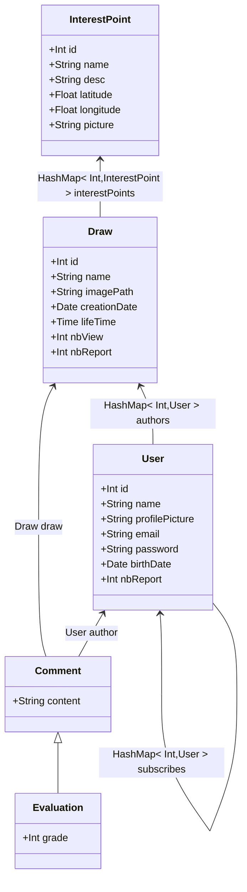

Class Diagram :
===

```mermaid
classDiagram

class User{
        +Int id
        +String name
        +String profilePicture
        +String email
        +String password
        +Date birthDate
        +Int nbReport
    }

class InterestPoint{
        +Int id
        +String name
        +String desc
        +Float latitude
        +Float longitude
        +String picture
}

class Draw{
        +Int id
        +String name
        +String imagePath
        +Date creationDate
        +Time lifeTime
        +Int nbView
        +Int nbReport
}

class Comment{
        +String content
}

class Evaluation{
        +Int grade
}

Comment <|-- Evaluation
User <-- Comment : User author
Draw <-- Comment : Draw draw
User <-- User : HashMap< Int,User > subscribes
Draw <-- User : HashMap< Int,User > authors
InterestPoint <-- Draw : HashMap< Int,InterestPoint > interestPoints


```
