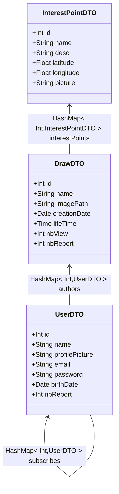

Class Diagram : (DTO's classes) 
===

```mermaid
classDiagram

class UserDTO{
        +Int id
        +String name
        +String profilePicture
        +String email
        +String password
        +Date birthDate
        +Int nbReport
    }

class InterestPointDTO{
        +Int id
        +String name
        +String desc
        +Float latitude
        +Float longitude
        +String picture
}

class DrawDTO{
        +Int id
        +String name
        +String imagePath
        +Date creationDate
        +Time lifeTime
        +Int nbView
        +Int nbReport
}


UserDTO <-- UserDTO : HashMap< Int,UserDTO > subscribes
DrawDTO <-- UserDTO : HashMap< Int,UserDTO > authors
InterestPointDTO <-- DrawDTO : HashMap< Int,InterestPointDTO > interestPoints

```

